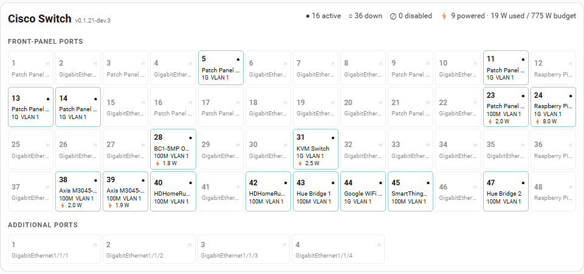

# Cisco Catalyst Port Dashboard

A Home Assistant dashboard card that restores a switch-wide operational view for Cisco Catalyst physical ports exposed by the `cisco_catalyst` integration.

> [!IMPORTANT]
> This project is under active development. Test administrative and PoE controls carefully before relying on the card for production switch management. VLAN configuration writes are not implemented.

## What it provides

- Ordered Catalyst 3650 48-port front-panel view plus a separate four-port additional-interface group.
- Link/admin state, description, negotiated speed, VLAN/trunk context, and live PoE draw in compact tiles.
- Switch summary for active/down/disabled/unknown ports and PoE usage/budget.
- Click/tap port detail dialog with interface, VLAN, PoE, traffic, error/discard, MAC/IP, CDP, and LLDP information.
- Port Enabled and PoE Enabled controls through normal Home Assistant `switch.turn_on` / `switch.turn_off` services.
- Live entity-state updates without re-fetching the device/entity registries on every Home Assistant state update.
- Visual card configuration form with a Catalyst device selector.
- Responsive 24/12/4-column layouts while preserving sequential physical order.
- Keyboard navigation for port tiles and port-detail dialogs.

## Requirements

- Home Assistant with the Cisco Catalyst custom integration installed and configured.
- A Catalyst switch represented by that integration as a parent device with physical port child devices.
- For the currently targeted Catalyst 3650 layout, 48 primary ports plus four additional physical interfaces are supported.

## Installation with HACS

HACS is the preferred installation method once this repository is available through HACS.

### HACS default repository

If this project is listed in HACS:

1. Open **HACS** in Home Assistant.
2. Search for **Cisco Catalyst Port Dashboard**.
3. Select it and choose **Download**.
4. Reload the Home Assistant frontend when prompted.
5. Edit a dashboard and add **Cisco Catalyst Switch Card**.

### HACS custom repository

If the project is public but has not yet been added to the HACS default repository:

1. Open **HACS**.
2. Open the HACS menu and choose **Custom repositories**.
3. Enter the GitHub repository URL for this project.
4. Select **Dashboard** as the repository type and add it.
5. Find **Cisco Catalyst Port Dashboard** in HACS and choose **Download**.
6. Reload the Home Assistant frontend.
7. Edit a dashboard and add **Cisco Catalyst Switch Card**.

If HACS does not automatically register or refresh the frontend resource, check **Settings → Dashboards → Resources** and verify that the card's JavaScript module is present.

## Manual installation

Manual installation is useful for development, troubleshooting, or systems where HACS is not installed.

1. Download the root `cisco-catalyst-switch-card.js` file from the latest release/source. Make sure you save the JavaScript file itself, not a GitHub HTML page.
2. Create this directory under your Home Assistant configuration directory if necessary:

   ```text
   www/cisco-catalyst-switch-card/
   ```

3. Copy the file to:

   ```text
   <home-assistant-config>/www/cisco-catalyst-switch-card/cisco-catalyst-switch-card.js
   ```

   On Home Assistant OS or Supervised installations, this is normally `/config/www/cisco-catalyst-switch-card/cisco-catalyst-switch-card.js`. File editor, Studio Code Server, Samba, SSH, or another normal file-copy method can be used.

4. If you created the `www` directory for the first time, restart Home Assistant so `/local/` resources become available.
5. In Home Assistant, go to **Settings → Dashboards → Resources** and add:

   ```text
   /local/cisco-catalyst-switch-card/cisco-catalyst-switch-card.js
   ```

   Select **JavaScript Module** / `module` as the resource type. Depending on your Home Assistant version and profile, the Resources page may be available from the Dashboards overflow menu and may require **Advanced Mode**.

6. Refresh the Home Assistant frontend and reopen the dashboard/card picker.
7. Edit a dashboard, choose **Add card**, select **Cisco Catalyst Switch Card**, and choose your Catalyst switch in the visual editor.

The equivalent YAML card configuration is:

```yaml
type: custom:cisco-catalyst-switch-card
switch_device_id: <home-assistant-device-id>
```

### Updating a manual installation

Replace the installed JavaScript file with the current `cisco-catalyst-switch-card.js` and refresh the frontend. Browser caching can be aggressive; during development, changing the registered resource URL from, for example, `...?v=1` to `...?v=2` can force a fresh load.

### Removing a manual installation

Remove the dashboard resource entry, remove the installed JavaScript file, refresh Home Assistant, and remove any dashboard cards configured with `custom:cisco-catalyst-switch-card`.

## Configuration

The recommended configuration method is the Home Assistant visual card editor. Select the Catalyst switch and optionally provide a card title.

Minimal YAML:

```yaml
type: custom:cisco-catalyst-switch-card
switch_device_id: <home-assistant-device-id>
```

The card discovers the switch's physical-port child devices and their entities; users should not need to maintain a 48/52-port entity list.

## Keyboard navigation

Port tiles support keyboard operation as well as pointer input. Navigation follows the card's **actual rendered geometry**, so Up/Down continues to work correctly as the responsive grid changes column count.

| Key | Port grid | Port-detail dialog |
| --- | --- | --- |
| `Tab` / `Shift+Tab` | Normal focus traversal | Normal focus traversal through dialog controls |
| `Enter` / `Space` | Open the focused port | Activate the focused control |
| `Left` / `Right` | Move to the adjacent port in the rendered row | — |
| `Up` / `Down` | Move to the nearest port in the rendered row above/below | Scroll a small amount when the dialog overflows |
| `Home` / `End` | Move to the far-left/far-right port in the current rendered row | Scroll to the top/bottom when the dialog overflows |
| `Ctrl+Home` / `Ctrl+End` | Move to the topmost/bottommost port in the current rendered column | — |
| `Page Up` / `Page Down` | — | Scroll approximately one dialog page when the dialog overflows |
| `Escape` | — | Close the dialog and return focus to the port that opened it |

Arrow-key grid navigation stays within the current physical port group. For example, navigation in the front-panel grid does not jump into the separate Additional Ports grid.

## Safety and data ownership

Administrative port and PoE controls call the integration's existing Home Assistant switch entities. SNMP writes, readback, and reconciliation remain the Cisco Catalyst integration's responsibility.

The dashboard is a presentation and interaction layer. Live switch state remains authoritative on the switch/integration, and durable infrastructure inventory should remain in the user's chosen inventory/source-of-truth system rather than being duplicated in this dashboard.

## Integration contract compatibility

Current development consumes **dashboard contract v1** from the Cisco Catalyst integration when the parent switch advertises `dashboard_contract_version: 1`.

Contract v1 supplies explicit physical interface identity/layout metadata and semantic entity roles, so the dashboard does not need to derive those from user-facing Home Assistant names or integration `unique_id` patterns.

For compatibility with older integration versions, the dashboard still retains the v0.1.16 legacy heuristics for Catalyst 3650 interface layout and semantic role inference. The explicit contract is preferred whenever available; the legacy path is intended only for the compatibility window.

## Development

Requires Node.js 22 for the current CI target.

```sh
npm test
npm run build
node --check cisco-catalyst-switch-card.js
```

The build writes `dist/cisco-catalyst-switch-card.js`. CI also verifies that the generated bundle matches the root `cisco-catalyst-switch-card.js` distributed to Home Assistant.

## AI-assisted development

This project was developed with substantial assistance from **OpenAI ChatGPT, GPT-5.6 Sol**.

The AI has been used as an engineering assistant for architecture, Home Assistant/HACS documentation research, implementation, tests, build/CI work, code review, and repository maintenance. Changes are committed to the repository and validated by automated tests/build checks so readers can inspect the resulting source rather than relying on AI-generated claims.

Useful context for evaluating that contribution:

- **Model:** GPT-5.6 Sol.
- **Role:** AI engineering assistant; the project owner directs requirements, architecture boundaries, deployment, and real-device validation.
- **Tool access during development:** repository read/write access through the GitHub integration, current public web/documentation research, and isolated code/tool execution where available.
- **Validation:** automated tests, build/static validation where applicable, and repository CI checks are used to validate changes.
- **Limits:** the model does not independently operate or continuously observe the user's Home Assistant instance or Catalyst switch. Real-device behavior must therefore be validated against the user's Home Assistant environment.
- **Reproducibility:** source, tests, build/validation configuration, and distributable artifacts where applicable are kept in the repository so changes can be reviewed without requiring access to the original ChatGPT conversation.

AI assistance does not imply endorsement, review, or support by OpenAI, Home Assistant, HACS, or Cisco.

## Dashboard preview


